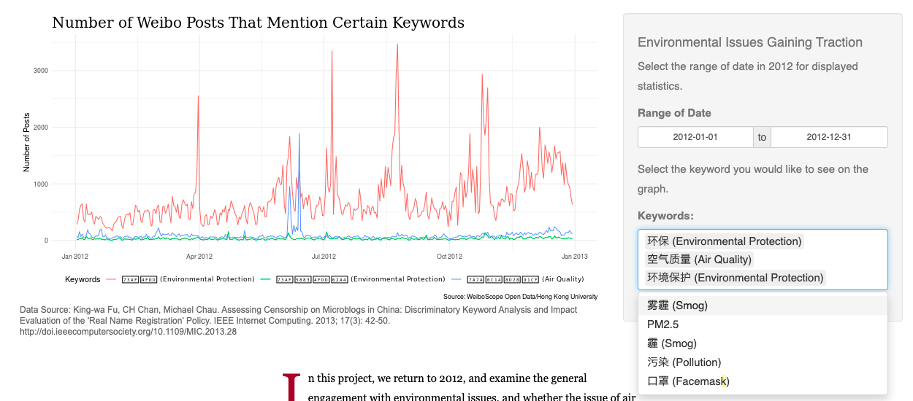
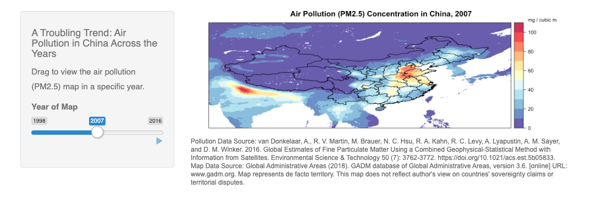
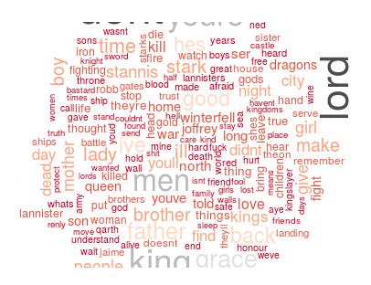
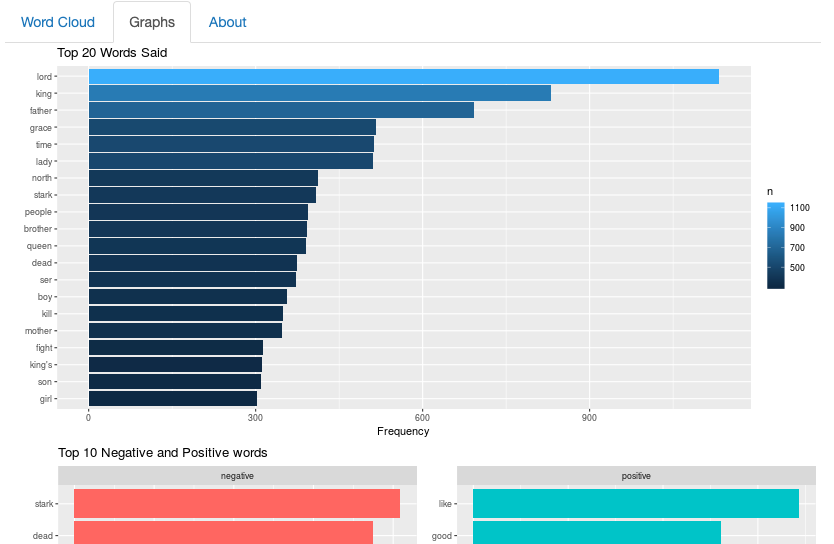

**PROJECT1:  Ruoqi Zhang: Settling the Dust: Censorship & Environmental Activism in China, 2012.**

*Pros*:

1. Scope of Project: This project is very ambituous in tackling an environmental awareness issue. Besides PM2.5 data across geography and time, she also collected and cleaned 52 weeks of data on Weibo posts. The data on cencorship together with pollution tells a very vivid and complex story across environmental protection and politics. 

2. Interactivity: the time slider and keyword labeler (shown in the screenshot below) allow user to explore data on their own, and find compelling stories based on personal interests

3. Introduction and Context Setting: Ruoqi tells a compelling story at the beginning and across sections, allowing users to be immerged in an engaging story rather than being overwhelmed by complex data visualization.

*Cons*:

The angel of this map is confusing visually -- it is suggesting some three dimensionality by having the tilted view, yet not really utilizing 3D data. For visualizing 2D geography data, a flat view would be easier for the viewers to digest.

**PROJECT2: Tate Green: Game of Thrones Analysis.**

*Pros*:

1. Interesting Way of Visualization: The word map, compared to bar charts or line charts, is a more interesting way of conveying information and bringing fun to the visualization. It also fits well into the topic of analysis of a show.

2. Segmentation: the visual by default divides the wordcount into seasons, making digesting/comparing information easier.

*Cons*:

1.Limitation of dataset: The fact that the dataset is based on frequency in converastion makes words like "men", "they" show up high on the list, which is not very informative for the viewers.

2.Ambiguity in labelling: The initial wordmap is broken down by each individual season, while the summary barchart below is for all seasons. Clearer labelling would help with navigating through the projects.

